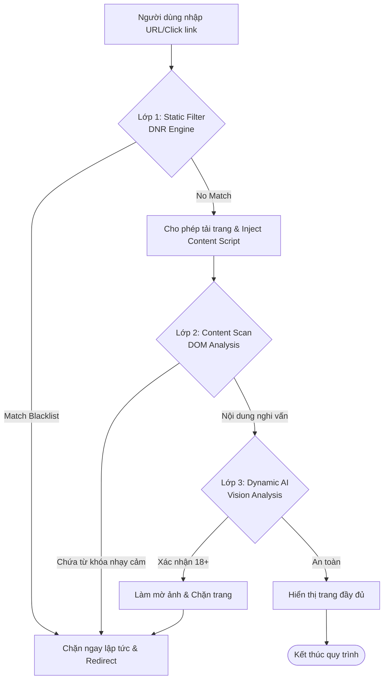
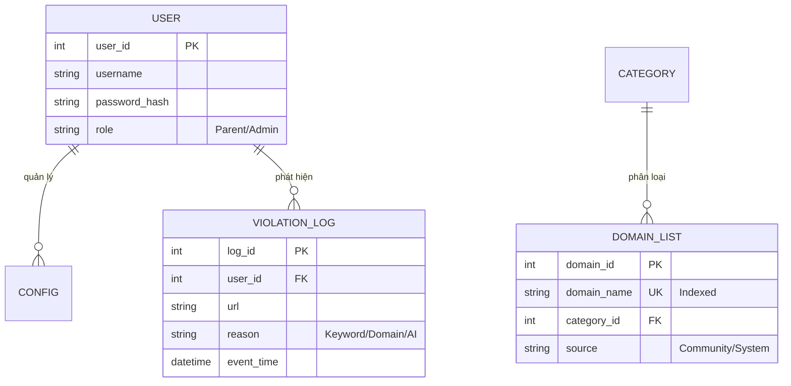

# 🛡️ Project: Web Shield 18+ (Ultimate Content Filter)

**Web Shield 18+** là một Browser Extension thế hệ mới, được thiết kế để bảo vệ người dùng khỏi các nội dung không phù hợp. Dự án tập trung vào 3 trụ cột: **Hiệu suất cực cao**, **Bảo mật quyền riêng tư** và **Trí tuệ nhân tạo (Local AI)**.

---

## 🏗️ 1. Kiến trúc hệ thống (Architecture)

Hệ thống sử dụng mô hình **Multi-Layer Filtering** (Lọc đa lớp) để đảm bảo không một nội dung xấu nào lọt qua mà vẫn giữ được tốc độ duyệt web mượt mà.

### Quy trình xử lý (Logic Flow)

```markdown
# 🛡️ Project: Web Shield 18+ (Ultimate Content Filter)

**Web Shield 18+** là một Browser Extension thế hệ mới, được thiết kế để bảo vệ người dùng khỏi các nội dung không phù hợp. Dự án tập trung vào 3 trụ cột: **Hiệu suất cực cao**, **Bảo mật quyền riêng tư** và **Trí tuệ nhân tạo (Local AI)**.

---

## 🏗️ 1. Kiến trúc hệ thống (Architecture)

Hệ thống sử dụng mô hình **Multi-Layer Filtering** (Lọc đa lớp) để đảm bảo không một nội dung xấu nào lọt qua mà vẫn giữ được tốc độ duyệt web mượt mà.

### Quy trình xử lý (Logic Flow)



---

## 🗄️ 2. Mô hình dữ liệu (Database Schema)

Dự án sử dụng cơ chế đồng bộ giữa Backend (Oracle/PostgreSQL) và bộ nhớ tạm thời tại trình duyệt (IndexedDB).

### Sơ đồ thực thể quan hệ (ERD)



---

## 🛠️ 3. Công nghệ sử dụng (Tech Stack)

| Thành phần | Công nghệ | Mục đích |
| --- | --- | --- |
| **Extension** | JavaScript (Manifest V3) | Tối ưu hóa hiệu suất và bảo mật trình duyệt. |
| **AI Engine** | TensorFlow.js (NSFW-JS) | Nhận diện ảnh 18+ trực tiếp trên GPU máy khách. |
| **Backend** | Java 21 (Spring Boot 3) | Xử lý logic nghiệp vụ và đồng bộ dữ liệu lớn. |
| **Database** | Oracle / PostgreSQL | Lưu trữ danh sách chặn và nhật ký truy cập. |
| **DevOps** | Docker, GitHub Actions | Triển khai nhanh chóng và tự động hóa. |

---

## 📅 4. Lộ trình phát triển (Project Roadmap)

### Giai đoạn 1: Nền tảng & Chặn tĩnh (Tuần 1-2)

* [ ] Khởi tạo Boilerplate Extension với Manifest V3.
* [ ] Xây dựng file `rules.json` ban đầu (hơn 10,000 domain).
* [ ] Thiết kế giao diện trang `blocked.html`.
* [ ] Triển khai tính năng Whitelist/Blacklist thủ công.

### Giai đoạn 2: Backend & Đồng bộ hóa (Tuần 3-4)

* [ ] Xây dựng Spring Boot API quản lý danh sách domain.
* [ ] Viết script Crawler tự động lấy dữ liệu từ các nguồn cộng đồng.
* [ ] Cơ chế Sync: Extension tải các bản cập nhật mới (Incremental Update).

### Giai đoạn 3: Trí tuệ nhân tạo & Phân tích động (Tuần 5-6)

* [ ] Tích hợp **TensorFlow.js** vào Content Script.
* [ ] Phát triển logic quét DOM: phân tích Title, Meta Tags và mật độ từ khóa.
* [ ] Tính năng "Safe Blur": Làm mờ ảnh nhạy cảm trước khi hiển thị.

### Giai đoạn 4: Tối ưu & Kiểm thử (Tuần 7-8)

* [ ] Triển khai thuật toán **Bloom Filter** để tối ưu bộ nhớ Local.
* [ ] Kiểm thử hiệu năng (Load Test) bằng **Vegeta**.
* [ ] Đóng gói Docker và phát hành bản thử nghiệm (Beta).

---

## 🚀 5. Giải pháp tối ưu hóa chuyên sâu

1. **Hiệu suất:** Tận dụng API `declarativeNetRequest` để trình duyệt tự động chặn ở mức network, không gây lag CPU.
2. **Dữ liệu lớn:** Sử dụng **Bloom Filter** để nén danh sách 1 triệu domain xuống chỉ còn vài MB, giúp tra cứu với độ trễ gần như bằng 0.
3. **Quyền riêng tư:** Mọi quá trình phân tích hình ảnh/văn bản đều diễn ra **Local** trên máy người dùng, không gửi dữ liệu về Server.

---

## 💻 6. Hướng dẫn cài đặt nhanh

1. **Extension:**
* Truy cập `chrome://extensions/`.
* Bật **Developer mode**.
* Chọn **Load unpacked** và dẫn tới thư mục `/extension`.


2. **Backend:**
* Yêu cầu: JDK 21, Docker.
* Chạy lệnh: `docker-compose up -d`.


3. **Database:**
* Thực thi các script trong thư mục `/database/setup.sql`.


---

**Đóng góp:** Mọi Pull Request đều được chào đón nhằm xây dựng môi trường mạng an toàn hơn.
**Ngày khởi tạo:** 06/01/2026

```

Bạn có thể lưu nội dung này vào file `README.md` trong thư mục gốc của dự án. **Tiếp theo, bạn có muốn tôi hướng dẫn cấu trúc thư mục chi tiết để bắt đầu code phần Extension không?**

```